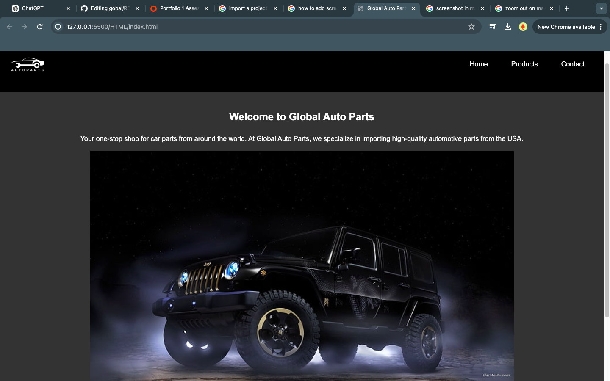
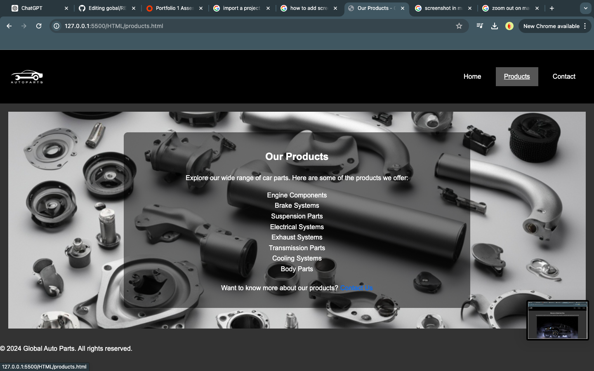
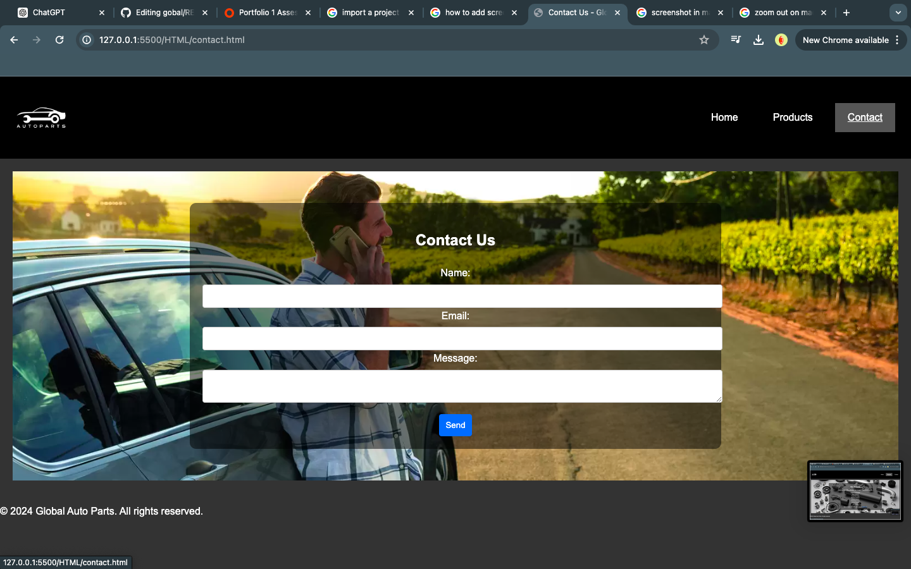

# Global Auto Parts

Welcome to Global Auto Parts, your one-stop shop for car parts from around the world. We specialize in importing high-quality automotive parts from the USA, ensuring that you get the reliability and performance you need for your vehicle.

## Table of Contents

- [Project Purpose](#project-purpose)
- [Features](#features)
- [Screenshots](#screenshots)
- [Installation](#installation)
- [Deployment](#deployment)
- [Technologies Used](#technologies-used)
- [License](#license)
- [Contact](#contact)

## Project Purpose

The purpose of this project is to provide a user-friendly, responsive website for Global Auto Parts. The website aims to enhance user experience, accessibility, and responsiveness, ensuring customers can easily find and purchase automotive parts.

## Features

- **Main Navigation Menu**: Easy-to-use navigation menu to access different sections of the site.
- **Home Page**: Welcome message, company mission, and featured image.
- **Products Page**: List of available car parts, categorized for easy browsing.
- **Contact Page**: Form for users to get in touch with the company.

## Screenshots

### Home Page


### Products Page


### Contact Page


## Installation

To get a local copy of this project, follow these steps:

1. Clone the repository:
   ```bash
   git clone https://github.com/Dossantos07/global.git
Navigate to the project directory:
bash
Copy code
cd global-auto-parts
Usage
Open the index.html file in your browser to view the website locally.

## Deployment
This project is deployed using GitHub Pages. To deploy your own version, follow these steps:

Commit all changes to your local repository.
Push the changes to GitHub.
Go to the repository settings on GitHub and enable GitHub Pages, selecting the appropriate branch and folder.
## Technologies Used
HTML5
CSS3
Git & GitHub for version control
Contributing
Contributions are welcome! Please follow these steps to contribute:

Fork the repository.
Create a new branch:
bash
Copy code
git checkout -b feature/your-feature-name
Make your changes and commit them:
bash
Copy code
git commit -m "Add your feature description"
Push to the branch:
bash
Copy code
git push origin feature/your-feature-name
Open a pull request.
## License
This project is licensed under the MIT License. See the LICENSE file for details.

## Contact
If you have any questions or feedback, feel free to reach out:

Email: contact@globalautoparts.com
Website: Global Auto Parts
